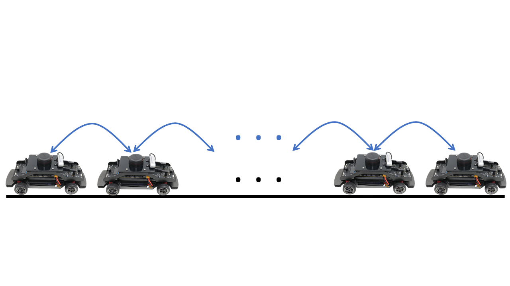

# OJCSYS_2023

Welcome to the OJCSYS_2023 repository! Here, we focus on implementing and exploring the intriguing trade-offs between the update cycle and the network density of the graph in the context of vehicle platoon systems.

## About the Project

Our primary objective is to put our theoretical findings to the test using real-world scenarios. To achieve this, we have harnessed the capabilities of Quanser's Qcar, a versatile platform for practical implementation of control systems. Our experiments are designed to examine the application of our theoretical framework in scenarios where real-world systems may deviate from ideal design models, introducing inherent noise due to hardware constraints.

## Implementation Phases

Our project unfolds in two distinct phases, each targeting a different aspect of our research:

### Phase 1: Real-world Implementation

In this phase, we utilize Quanser's Qcar to build and implement a real vehicle platoon system. The control of these vehicles is orchestrated from a central control station. The entire codebase for this phase is developed using MATLAB, enabling seamless integration with the Qcar platform.

### Phase 2: Virtual Implementation

Transitioning to a virtual environment, we enter Phase 2 by leveraging Quanser's Qlabs. Here, our focus shifts to implementing the vehicle platoon system virtually, utilizing a set of simulated cars. For this phase, we switch our programming language to Python, allowing us to harness Qlabs' capabilities effectively.

## Repository Structure

This repository is organized to streamline your exploration of our project's code and findings. You'll find dedicated directories for each implementation phase, along with detailed code explanations and any additional resources used in our research.

