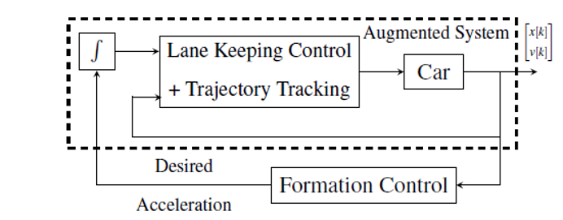
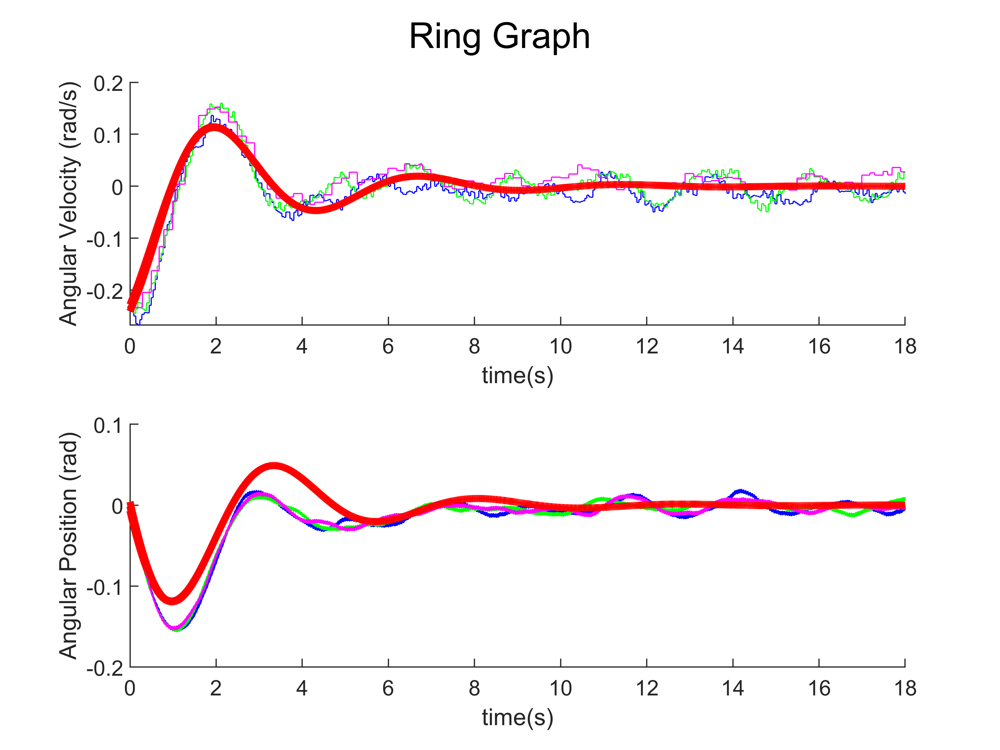
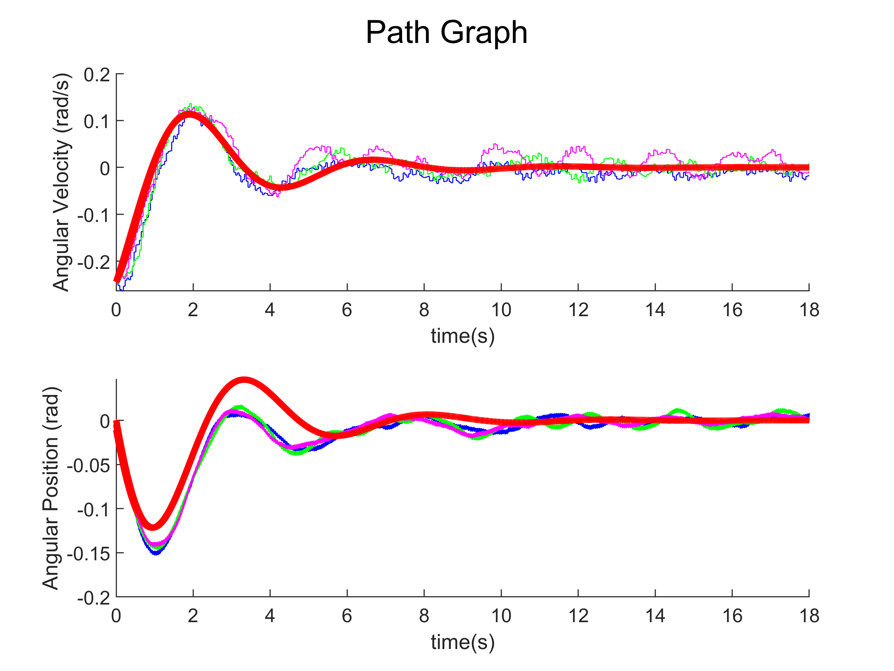

# Real-world Implementation with QCars

Welcome to the real-world implementation phase of our OCJSYS2023 project! In this section, we embark on a hands-on exploration of our theoretical advancements, applying them to real-time scenarios using Quanser's QCars. These experiments are conducted remotely via Wi-Fi connectivity, allowing us to delve into the practical implications of our research. Our experiments take place in a controlled environment equipped with six Opti-track motion capture cameras.

## Experimental Setup

Our experimental setup is meticulously crafted to mirror real-world conditions. The experiments are structured as follows:

1. **Lane-Keeping Control**: To kick-start our experiments, we apply a lane-keeping control mechanism. This ensures that the QCars remain within a pre-specified maneuvering space, while still accommodating variations in their velocities. We design a circular trajectory with a radius of 0.85 meters in our Lab setup.

2. **Tracking Desired Trajectories**: Each QCars agent is assigned a desired trajectory that evolves based on their initial position and a fixed desired velocity applicable to all cars. The entire system operates with a focus on localized control for each agent, independently of its neighbors.

3. **Augmented System**: We illustrate this localized control approach using the "Augmented System" block in Fig. \ref{fig:ExpBlkDiag}. This block represents a collective of independently actuated augmented agents, each autonomously following its trajectory.

4. **Formation Control Strategy**: In the subsequent step, each augmented agent receives desired acceleration inputs from a formation control strategy. This strategy centers around maintaining a safe distance from neighboring agents, adhering to a specific network structure.

It's noteworthy that the inherent non-linearity of the real system introduces a layer of uncertainty, serving as a form of validation for the robustness of our feedback law. Although we don't artificially introduce Gaussian noise into the simulated system, this non-linearity serves as an organic source of uncertainty, ultimately reinforcing the robustness of our approach.

## Implementation Details

The architecture of these experiments largely mirrors the previous section. However, we introduce an additional layer in the form of an internal PI controller. This controller enhances the QCars' ability to track velocity references, ensuring smooth and precise movement. The controller parameters are meticulously tuned to minimize steady-state error and maintain uniform rising times for each vehicle.

It's important to note that while our car formation diverges from a typical linear consensus network, the insights derived from analyzing the interconnections' structure remain relevant. We select the underlying interconnection to resemble a ring graph and path graph for our experiments. 

## Code Architecture

Our codebase, as previously outlined, is developed using MATLAB Simulink. Here's an overview of the key components and their functionalities:

- **Individual Car Models**: The code for each individual car is encapsulated in separate Simulink models, named as CAR_11.slx, CAR_12.slx, and CAR_13.slx. These models encompass the control strategies and logic specific to each car. It receives the velocity input from the Client and the required steering angle is computed by intself individually.

- **Client Logic**: The base station in the lab runs the client code, named as Client.slx. This code orchestrates the overall control structure, acting as the central command center for our experiments.

- **Control Structure**: The complete control structure is implemented in this architecture. The client part handles the desired velocity, which is then transmitted to the cars. On the other hand, each individual car model takes care of determining the desired steering angle based on following a fixed lane.

This architecture enables seamless communication and coordination between the individual cars and the base station. Each car autonomously responds to the instructions provided by the client code while adhering to the desired velocity and lane following directives.

 <b> Figure Depicts the detailed Block Diagram for the experimental setup   </b> 

## Digging into the Results

Throughout this phase, we closely examine how our theoretical framework aligns with real-world dynamics. Our goal is to bridge the gap between theory and practicality, gaining valuable insights into the behavior of our vehicle platoon system when subjected to real-world conditions.

  
  

 <b> This figure depicts the sampled data from our experiments with a Ring Graph(left)  and Path Graph (right) with the simulation results for the fitted consensus network (red).   </b> 

