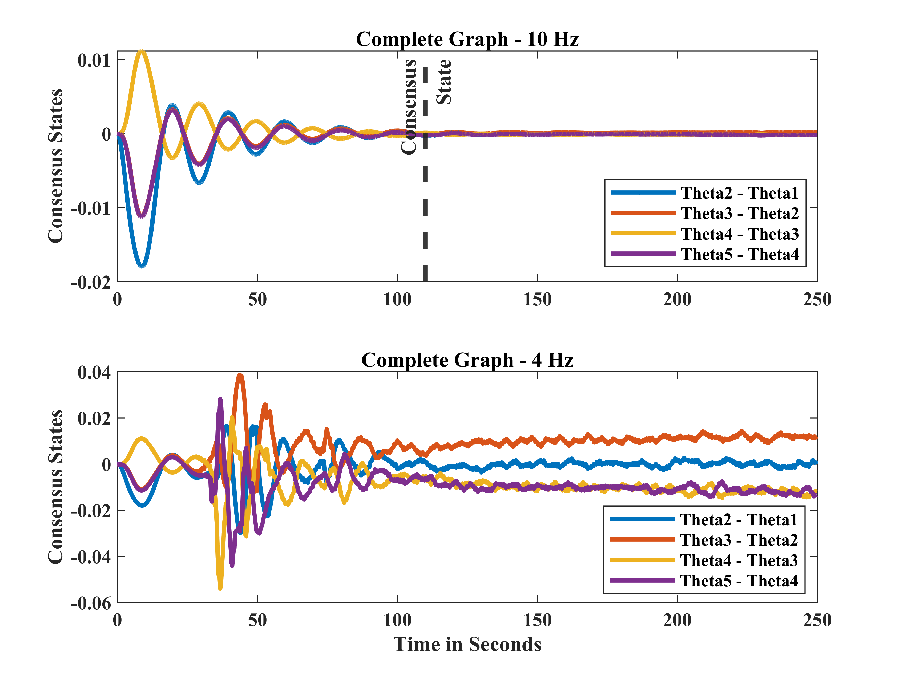
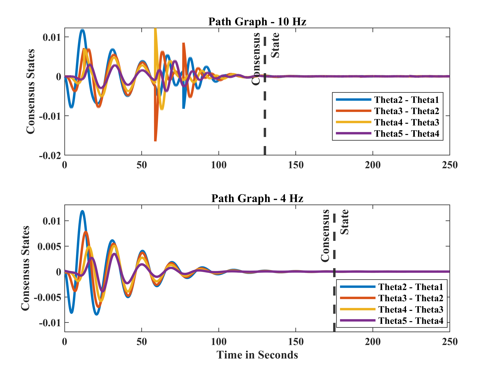
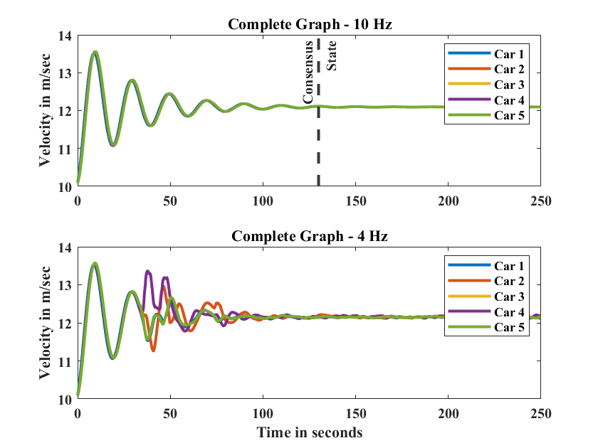
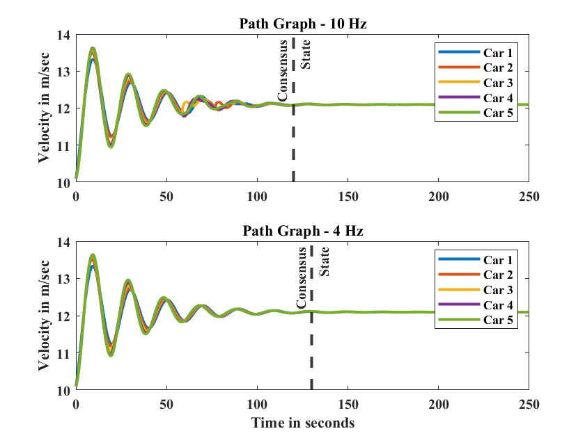

# Virtual Car Implementation with Qlabs

Welcome to the virtual car implementation phase of our OCJSYS2023 project! In this section, we take our theoretical advancements for a spin in a virtual environment using Quanser's Qlabs. These experiments provide us with a platform to validate and fine-tune our concepts under controlled conditions.

## Experimental Setup

Our virtual experimental setup is designed to mimic real-world scenarios, enabling us to observe how our theoretical framework performs in a controlled environment. Here's how the experiments are structured:

1. **Virtual Car Models**: We leverage Quanser's Qlabs to create virtual car models. These models act as digital replicas of real-world vehicles, allowing us to execute experiments in a controlled and replicable manner. We ensure that the cars follow a circular trajectory of 20 meters in radius.

2. **Trajectory Tracking**: Similar to the real-world setup, each virtual agent follows a desired trajectory that evolves based on its initial position and a fixed desired velocity, consistent across all virtual cars.

3. **Localized Control**: Just as before, the entire system operates with a focus on localized control for each virtual agent. This approach allows each virtual car to autonomously navigate its trajectory without relying on interactions with its virtual neighbors.

4. **Formation Control Strategy**: The augmented agents in our virtual environment also receive desired acceleration inputs from our formation control strategy. This strategy ensures that the virtual cars maintain a safe distance from one another, following a specific network structure.

## Virtual Experimentation

This phase grants us the opportunity to perform controlled experiments that shed light on the behavior of our theoretical framework in an environment where noise is minimal and conditions can be tightly regulated. By navigating through these virtual scenarios, we fine-tune our concepts and validate their reliability under controlled circumstances.

  
  

 <b> Graph depicts Consensus in Position for 5 Nodes when the underlying topology connecting the cars is a Complete Graph(left) and a Path Graph(right)   </b> 

  
  

 <b> Graph depicts Consensus in Velocity for 5 Nodes when the underlying topology connecting the cars is a Complete Graph(left) and a Path Graph(right)   </b> 

